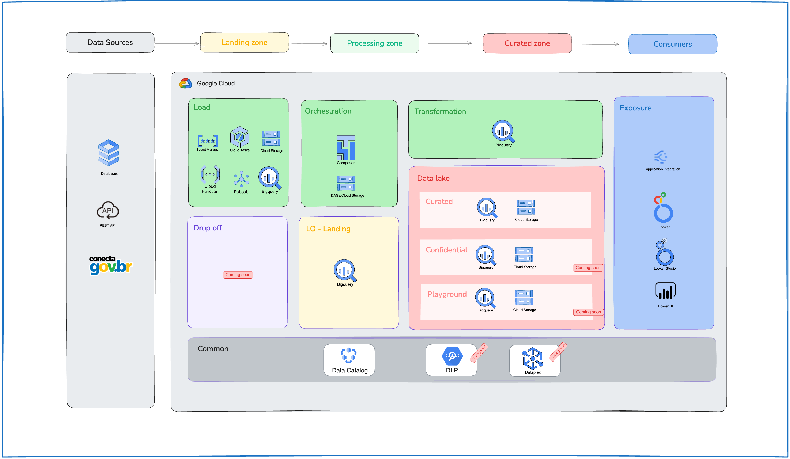

# Government Data Platform (GDP)

This repository provides a reference architecture followed by end-to-end blueprints, scripts and a suite of Terraform modules for Google Cloud Platform (GCP). It is specifically designed to automate the creation, governance, and observability of a modern and robust data repository to empower government agencies and organizations with data-driven decision-making capabilities.

Some key differentiators of this approach are:

- Organization-wide [landing zone](1-foundations/README.md) used to bootstrap the deployment of data foundations, the actual infrastructure (BigQuery-based) in which the whole organization's data (structured and unstructured) will be sitting on top of.
- Acceleration and automation of data ingestion through built-in [connectors (Composer pipelines)](docs/gdp-concepts.md) to some of the most popular educational tools in the market, with Moodle being one of them.
- Acceleration and automation of data ingestion from Restful Open APIs via built-in [connectors (Cloud Functions)](docs/gdp-concepts.md).
- Easily customizable via lean [Terraform modules](https://github.com/GoogleCloudPlatform/cloud-foundation-fabric/tree/master/modules/README.md).
- Ran in a scenario where only pieces of it would be suitable? No problem. You can pick and choose whatever bits work best for you.

> **Important:** The whole repository is meant to be cloned as a single unit to seed production usage.

## Documentation (more coming soon)

1. [GDP's concepts](docs/gdp-concepts.md)
2. [Architecture and components](docs/gdp-architecture.md)
3. [Pre-requisites for deploying GDP](docs/gdp-prerequisites.md)
4. [Deploying GDP's infrastructure](1-foundations/README.md)
5. How to use it
   1. [Workflow Configuration](docs/gdp-workflow-config.md)
   2. [How to deploy](/1-foundations/README.md#how-to-deploy)
